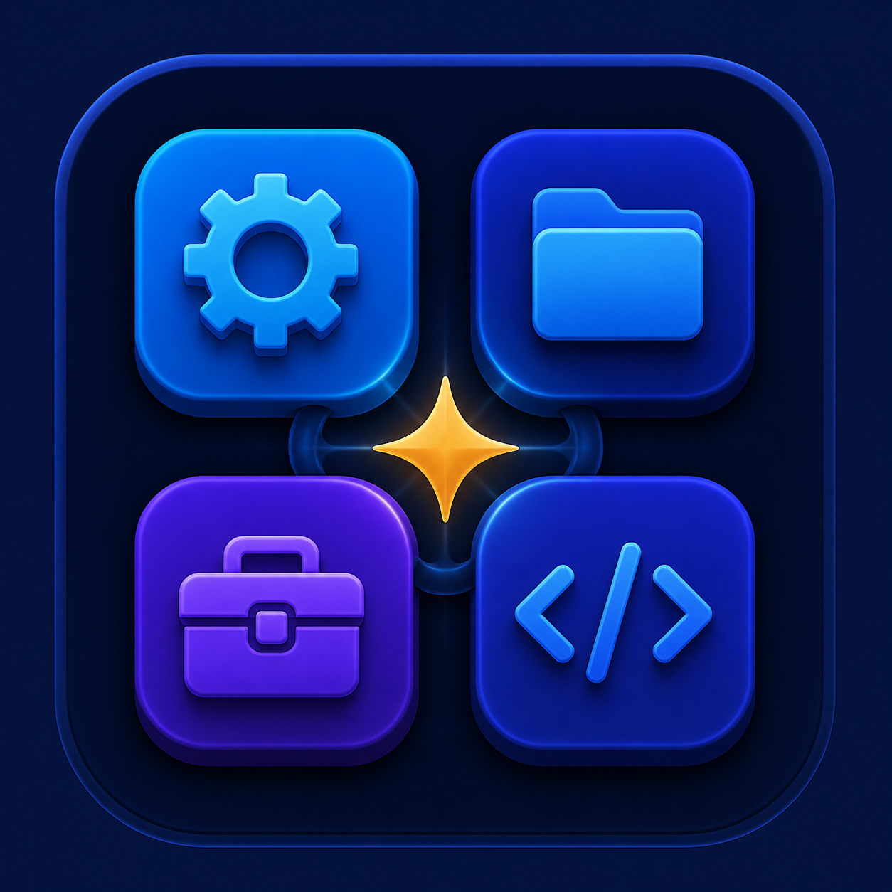

<p align="center">
  
</p>

<h1 align="center">Python App Utility Hub</h1>

<p align="center"><strong>Le tue utility desktop, tutte nello stesso punto.</strong><br>
Un launcher pulito per i piccoli strumenti Python che usi davvero.</p>

---

## Cos'è

Python App Utility Hub raccoglie le utility desktop in un'unica finestra semplice da usare. Seleziona un programma, leggi una breve descrizione e aprilo senza dover ricordare dove si trova il suo file di avvio.

Ogni utility mantiene la propria cartella, le proprie risorse e la propria documentazione. Il launcher condivide invece un solo ambiente Python, così l'intera raccolta rimane ordinata e pronta all'uso.

## Utility incluse

| Utility | Per cosa usarla |
| --- | --- |
| **Comic Tag Editor** | Modificare i metadati di fumetti PDF, CBR e CBZ. |
| **MP3 Tag Editor** | Convertire file audio in MP3 e aggiornare i tag dei brani. |
| **Correzione colore foto** | Migliorare automaticamente colore, contrasto e nitidezza. |
| **Foto simili** | Individuare immagini duplicate o molto simili. |
| **Immagini in PDF** | Creare uno o più PDF a partire da una cartella di immagini. |
| **Estrai audio da video** | Estrarre una o più tracce audio da un filmato. |
| **Editor tracce e sottotitoli** | Aggiungere, rimuovere e riordinare tracce audio e sottotitoli. |

## Installa la versione pronta all'uso

Non serve scaricare il codice sorgente, installare Python, creare ambienti virtuali o configurare FFmpeg. Dalla pagina **Releases** del repository scarica l'installer adatto al tuo computer, avvialo e segui i passaggi a schermo.

| Sistema | File da scaricare | Risultato |
| --- | --- | --- |
| Windows 10/11 a 64 bit | `Python-App-Utility-Hub-Setup-x.y.z.exe` | Installa l'app nel menu Start e, se desiderato, sul Desktop. |
| Mac con chip Apple (M1, M2, M3, M4…) | `Python-App-Utility-Hub-macos-arm64.pkg` | Installa l'app in `Applicazioni`. |
| Mac con processore Intel | `Python-App-Utility-Hub-macos-x64.pkg` | Installa l'app in `Applicazioni`. |

Ogni installer contiene già il runtime Python, le librerie necessarie, FFmpeg e FFprobe: le utility audio e video funzionano quindi senza altre installazioni. Apri **Python App Utility Hub** dal menu Start o dalla cartella Applicazioni, scegli l'utility e premi **Apri**.

Su macOS l'installer colloca sempre l'app in **Applicazioni** (`/Applications/Python App Utility Hub.app`), senza usare eventuali copie presenti nei Download o nella cartella del progetto.

L'interfaccia è disponibile sia in **Italiano** sia in **English**: puoi cambiare lingua direttamente dal selettore in alto.

## Per sviluppare dal sorgente

La modalità sorgente resta disponibile per chi contribuisce al progetto. Su macOS fai doppio clic su `Avvia Python App Utility Hub.command`; su Windows su `Avvia Python App Utility Hub.bat`. Al primo avvio viene creato automaticamente l'ambiente `.venv` e vengono installate le dipendenze condivise.

In questa modalità, le utility audio e video richiedono **FFmpeg** e, quando indicato, **FFprobe** disponibili nel `PATH` del sistema.

## Pubblicare una release

Per creare **con un doppio clic tutti gli installer**:

- su macOS apri [Crea installer all-in-one macOS.command](<Crea installer all-in-one macOS.command>);
- su Windows apri [Crea installer all-in-one Windows.bat](<Crea installer all-in-one Windows.bat>).

I due generatori chiedono soltanto il numero di versione e una conferma: verificano che il repository sia pulito, pubblicano `main`, creano il tag e avviano il workflow GitHub Actions [Crea release desktop](.github/workflows/release-desktop.yml). GitHub compila nativamente Windows x64, macOS Intel e macOS Apple Silicon, include Python, dipendenze, FFmpeg e FFprobe, poi allega i tre installer alla release. Richiedono Git configurato e autenticato su GitHub **solo sul computer che pubblica la release**; l'utente finale non dovrà installare Python né scaricare il sorgente.

Usa uno dei due file una sola volta per ogni versione: entrambi avviano la medesima release universale. In alternativa, puoi pubblicare manualmente la versione `1.0.0` creando e inviando il tag `v1.0.0`:

```bash
git tag v1.0.0
git push origin v1.0.0
```

Per evitare avvisi di Windows SmartScreen e macOS Gatekeeper, configura i certificati indicati nei commenti del workflow (`WINDOWS_CERTIFICATE_BASE64`, `WINDOWS_CERTIFICATE_PASSWORD`, `MACOS_CERTIFICATE_BASE64`, `MACOS_CERTIFICATE_PASSWORD`, `MACOS_CODESIGN_IDENTITY`, `MACOS_INSTALLER_IDENTITY`, `APPLE_ID`, `APPLE_TEAM_ID`, `APPLE_APP_SPECIFIC_PASSWORD`). Senza questi certificati gli installer vengono comunque creati, ma i sistemi operativi possono chiedere una conferma aggiuntiva al primo avvio.

## Una raccolta ordinata

- Un unico launcher desktop per sette utility Python.
- Un ambiente virtuale condiviso, senza installazioni duplicate.
- Ogni app resta isolata nella propria sottocartella di `apps/`.

---

Creato con il ❤️ da F.C.
