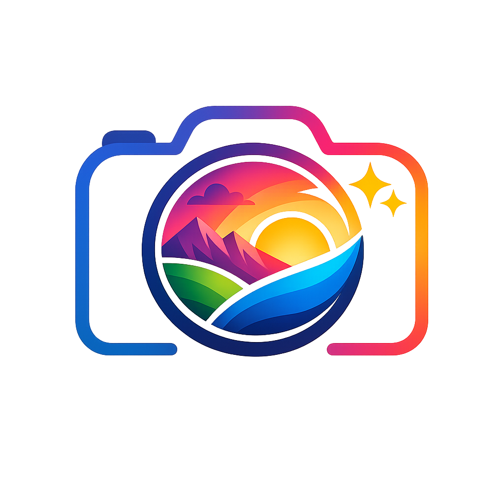

# Photos Color Correction



**Lingua / Language:** [Italiano](#italiano) | [English](#english)

## Italiano

Semplice programma Python per correggere automaticamente colore, contrasto e nitidezza delle foto contenute in una cartella, con un look piu' ricco e post-prodotto.

Il programma funziona su macOS e Windows. Crea copie corrette delle immagini, quindi gli originali non vengono modificati.

### Uso con doppio clic

#### macOS

Fai doppio clic su:

```text
Avvia Color Correction (MacOS).command
```

Alla prima apertura crea una `.venv` locale e installa Pillow. Poi apre la finestra grafica e chiude la console.

Se macOS blocca lo script perche' scaricato da internet, fai clic destro su `Avvia Color Correction (MacOS).command`, scegli `Apri`, poi conferma.

#### Windows

Fai doppio clic su:

```text
Avvia Color Correction (Windows).bat
```

Alla prima apertura crea una `.venv` locale e installa Pillow. Poi apre la finestra grafica usando `pythonw.exe` e chiude la console.

### Interfaccia grafica

Nella finestra puoi scegliere:

- lingua dell'interfaccia: Italiano o English
- cartella delle foto
- cartella di output
- preset di color correction
- intensita' della correzione
- anteprima su una foto campione della cartella selezionata
- ingrandimento dell'anteprima cliccando sulla foto
- impostazioni personalizzate per singola foto
- inclusione delle sottocartelle
- sovrascrittura dei risultati gia' esistenti

Per cambiare lingua, usa il menu `Lingua` nella finestra del programma.

### Installazione manuale

Serve Python 3.10 o superiore.

```bash
python -m pip install -r requirements.txt
```

Su macOS, se il comando `python` non esiste, usa:

```bash
python3 -m pip install -r requirements.txt
```

### Uso da riga di comando

Corregge le foto in una cartella e salva il risultato in `corrected` dentro quella cartella:

```bash
python photo_color_corrector.py "/percorso/alla/cartella/foto"
```

Su macOS puoi usare anche:

```bash
python3 photo_color_corrector.py "/percorso/alla/cartella/foto"
```

Per scegliere una cartella di output:

```bash
python photo_color_corrector.py "/percorso/foto" --output-folder "/percorso/foto-corrette"
```

Per includere anche le sottocartelle:

```bash
python photo_color_corrector.py "/percorso/foto" --recursive
```

Per aumentare o ridurre l'effetto:

```bash
python photo_color_corrector.py "/percorso/foto" --strength 1.3
python photo_color_corrector.py "/percorso/foto" --strength 0.6
```

Per scegliere un preset dalla riga di comando:

```bash
python photo_color_corrector.py "/percorso/foto" --preset vivid
python photo_color_corrector.py "/percorso/foto" --preset cinematic
python photo_color_corrector.py "/percorso/foto" --preset spectacular
```

La correzione combina bilanciamento del bianco, autocontrasto controllato, curva a S, vibrance selettiva, micro-contrasto e nitidezza. L'obiettivo e' ottenere colori piu' pieni e un aspetto simile a una foto uscita da una buona macchina fotografica e rifinita in post-produzione.

### Preset disponibili

- `natural`: Naturale, pulito e non aggressivo
- `professional`: Professionale, default bilanciato
- `vivid`: Vivace, colori piu' intensi
- `warm`: Caldo, piu' morbido e dorato
- `cool`: Freddo, piu' contrastato e moderno
- `portrait`: Ritratto, piu' delicato su pelle e dettagli
- `cinematic`: Cinematico, contrasto piu' deciso e ombre leggermente sollevate
- `spectacular`: Spettacolare, golden hour, volti piu' luminosi, colori paesaggio piu' intensi e micro-nitidezza piu' evidente
- `black_white`: Bianco e nero

### Anteprima e modifiche per singola foto

Nella finestra grafica puoi cliccare sull'anteprima `Originale` o `Corretto` per ingrandire la foto dentro la finestra del programma. Per chiudere la vista grande, clicca sulla foto ingrandita, premi `Esc` o usa `Chiudi`.

Le impostazioni globali valgono per tutte le foto. Se una foto richiede una correzione diversa:

1. scegli la foto con `Foto precedente` / `Foto successiva`
2. attiva `Personalizza solo questa foto`
3. scegli preset e intensita' per quella foto

Durante l'elaborazione, le foto personalizzate useranno i propri settaggi; tutte le altre useranno quelli globali.

Valori consigliati:

- `0.5`: correzione molto leggera
- `1.0`: correzione naturale, consigliata
- `1.5`: effetto piu' evidente
- `2.0`: massimo effetto

### Formati supportati

JPG, JPEG, PNG, TIFF, WEBP e BMP.

### Note

- Gli originali non vengono mai sovrascritti.
- Se un file corretto esiste gia', viene saltato.
- Per sovrascrivere i risultati gia' creati, aggiungi `--overwrite`.
- Per fare una prova senza scrivere file, aggiungi `--dry-run`.

## English

A simple Python program that automatically corrects color, contrast, and sharpness for all photos in a folder, with a richer post-produced look.

The program works on macOS and Windows. It creates corrected copies of the images, so the originals are never modified.

### Double-click usage

#### macOS

Double-click:

```text
Avvia Color Correction (MacOS).command
```

On first launch it creates a local `.venv` and installs Pillow. Then it opens the graphical interface and closes the console.

If macOS blocks the script because it was downloaded from the internet, right-click `Avvia Color Correction (MacOS).command`, choose `Open`, then confirm.

#### Windows

Double-click:

```text
Avvia Color Correction (Windows).bat
```

On first launch it creates a local `.venv` and installs Pillow. Then it opens the graphical interface with `pythonw.exe` and closes the console.

### Graphical interface

In the window you can choose:

- interface language: Italiano or English
- photo folder
- output folder
- color correction preset
- correction intensity
- preview from a sample photo in the selected folder
- enlarged preview by clicking the photo
- custom settings for individual photos
- subfolder inclusion
- overwrite for existing results

To change language, use the `Language` menu in the program window.

### Manual installation

Python 3.10 or newer is required.

```bash
python -m pip install -r requirements.txt
```

On macOS, if the `python` command does not exist, use:

```bash
python3 -m pip install -r requirements.txt
```

### Command-line usage

Corrects the photos in a folder and saves the result in `corrected` inside that folder:

```bash
python photo_color_corrector.py "/path/to/photo/folder"
```

On macOS you can also use:

```bash
python3 photo_color_corrector.py "/path/to/photo/folder"
```

To choose an output folder:

```bash
python photo_color_corrector.py "/path/photos" --output-folder "/path/corrected-photos"
```

To include subfolders:

```bash
python photo_color_corrector.py "/path/photos" --recursive
```

To increase or reduce the effect:

```bash
python photo_color_corrector.py "/path/photos" --strength 1.3
python photo_color_corrector.py "/path/photos" --strength 0.6
```

To choose a preset from the command line:

```bash
python photo_color_corrector.py "/path/photos" --preset vivid
python photo_color_corrector.py "/path/photos" --preset cinematic
python photo_color_corrector.py "/path/photos" --preset spectacular
```

The correction combines white balance, controlled autocontrast, an S-curve, selective vibrance, micro-contrast, and sharpening. The goal is to get fuller colors and a look similar to a good camera photo refined in post-production.

### Available presets

- `natural`: Natural, clean, and gentle
- `professional`: Professional, balanced default
- `vivid`: Vivid, more intense colors
- `warm`: Warm, softer and more golden
- `cool`: Cool, more contrasted and modern
- `portrait`: Portrait, gentler on skin and details
- `cinematic`: Cinematic, stronger contrast and slightly lifted shadows
- `spectacular`: Spectacular, golden hour, brighter faces, stronger landscape colors, and more visible micro-sharpness
- `black_white`: Black and white

### Preview and per-photo changes

In the graphical window you can click the `Original` or `Corrected` preview to enlarge the photo inside the program window. To close the large view, click the enlarged photo, press `Esc`, or use `Close`.

Global settings apply to every photo. If one photo needs a different correction:

1. choose the photo with `Previous photo` / `Next photo`
2. enable `Customize only this photo`
3. choose the preset and intensity for that photo

During processing, customized photos use their own settings; all other photos use the global settings.

Recommended values:

- `0.5`: very light correction
- `1.0`: natural correction, recommended
- `1.5`: stronger effect
- `2.0`: maximum effect

### Supported formats

JPG, JPEG, PNG, TIFF, WEBP, and BMP.

### Notes

- Originals are never overwritten.
- If a corrected file already exists, it is skipped.
- To overwrite existing results, add `--overwrite`.
- To test without writing files, add `--dry-run`.
